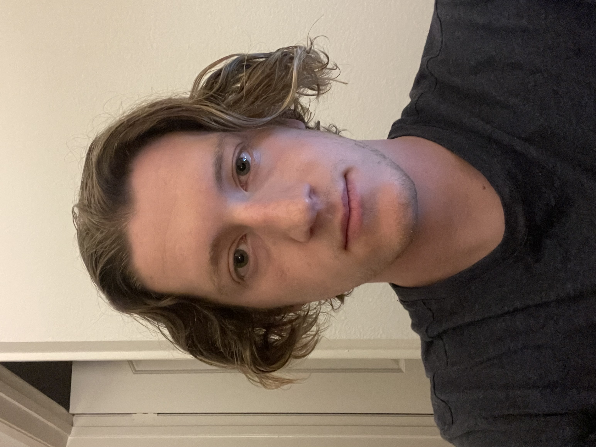

# Aaron Kann's User Profile

## Brief Intro

Hello, my name is Aaron Kann.  I am a second-year
Math-CS major at UCSD.  This is my user profile.  


## Me, as a programmer

As a coder, I am someone who usually jumps at the 
idea of creating a project, oftentimes before doing the needed planning.  

As a high schooler, I learned Python while  
quarantined with the intent of recreating [this board game](https://boardgamegeek.com/boardgame/70323/king-tokyo).

Next, I'll link a description of a project I took 
on to 
help my friends run thier ~~gambling discord~~ 
[small business](docs/BetAssistant): 

A snippet of code from that 
project looks  
like this:

```
// NFL OFFSEASON
if (sport == "NFL Football"){
    answer = "https://media.tenor.com/UnA0tbTf0DMAAAAd/flushed-rickroll.gif"
}
```

My career goals include
- [x] get off the CSE 110 waitlist 
- [ ] pass CSE 110
- [ ] be good at what I do
- [ ] work on something impactful to others
- [ ] \(optional) make bank


Coding languages I know, ranked:
1. Python
2. C++
3. JavaScript
4. Java
5. C
6. Assembly


## Personal Info

I was born in **New York**, but moved to 
**Seattle** at the
age of 14.  


My hobbies and interests include:
- avid soccer and baseball fan
- on the UCSD Club Water Polo Team
- played trumpet, currently learning the harmonica
- cooks a mean teryaki chicken

Here's a quote from a TV Series I like
(see if you recognize it)

> If we waited until we are ready, we'd be 
waiting for the rest of our lives.

Lastly, here is a picture of me
